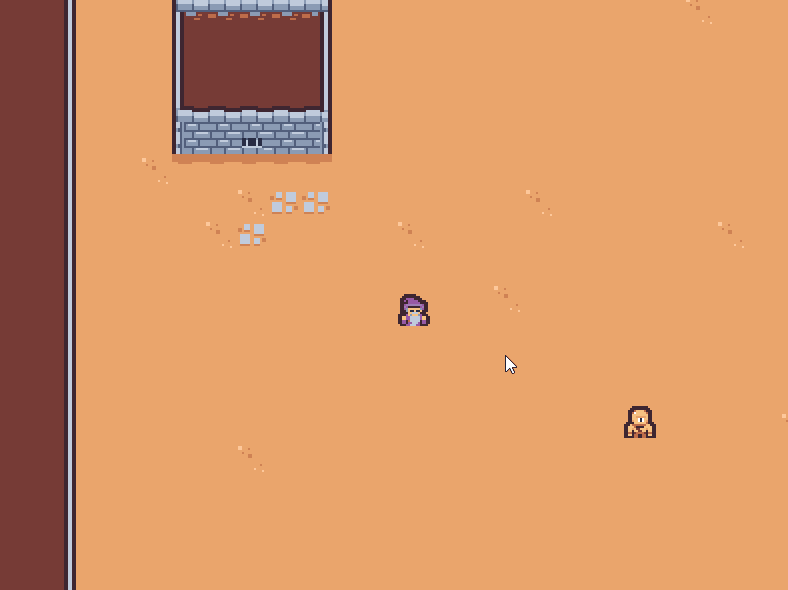
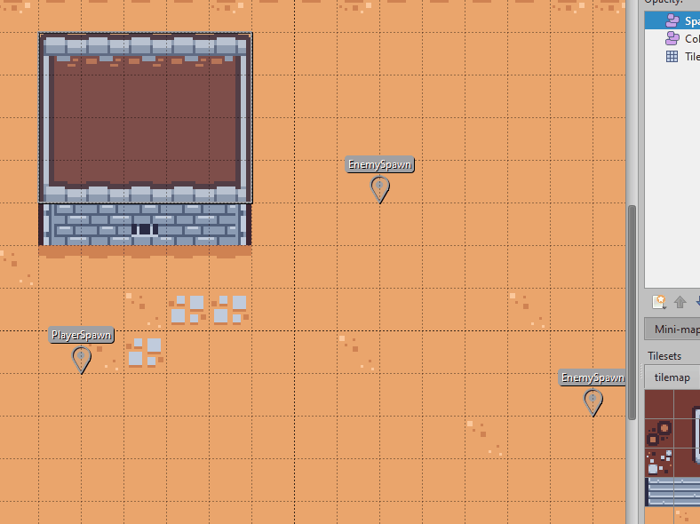

# Simple 2D Game Engine
Simple 2D game engine for learning and practicing modern C++, as well as developing a deeper understanding of game engine architecture. Feel free to use as you wish, just be warned that it was meant as an excerise and will not be receiving ongoing support.

## Main Features

### Custom ECS Implementation
Snippet of creating an enemy entity and adding components + flags....

        Entity enemy = registry->CreateEntity();
        enemy.AddFlags(EntityFlags::Enemy);
        enemy.AddComponent<TransformComponent>(
            glm::vec2(x, y),
            glm::vec2(1,1),
            0.0);

### Tiled Map Import Support
Suports importing maps created in the [Tiled](https://www.mapeditor.org/) editor, as .lua files. Tiled maps also can be used to define enemy/player placement + collision volumes.

### Lua Scripting
Add script components that can effect and react to native entities/systems. Here is a snippet of lua code that controls enemy movement, having them change direction when they hit an object.

    on_hit = function (this, other)
        local current_vel_x, current_vel_y = get_velocity(this);
        
        current_vel_x = current_vel_x * -1;
        current_vel_y = current_vel_y * -1;

        set_velocity(this, current_vel_x, current_vel_y);
    end

## Building
Open project in a terminal and run the following command (example is for Visual Studio, but any [Premake supported](https://premake.github.io/docs/Using-Premake) project files can be generated)

    ./premake vs2022

Built with C++17 standard, and dependant libraries ([Sol](https://github.com/ThePhD/sol2)) require project to be built with at least this standard.

### Windows
- 64 bit msvc compiled binaries are all that are supported curently, premake builds tested in vs2022

### OSX
- Mac builds are supported using xcode `./premake5 xcode4` 

## Credits
- Special thanks to [Gustavo Pezzi](https://twitter.com/pikuma) and his online C++ courses
- Assets are from Kenney's ["Tiny Dungeon" asset pack](https://www.kenney.nl/assets/tiny-dungeon)

### Libraries
- [Sol](https://github.com/ThePhD/sol2) - Lua Binding
- [Lua](https://www.lua.org/) - Scripting Language
- [SDL](https://github.com/libsdl-org/SDL) - Windowing/Rendering
- [Glm](https://github.com/g-truc/glm) - Math
- [Dear Imgui](https://github.com/ocornut/imgui) - Debug GUI
- [Premake](https://premake.github.io/) - Project Generation